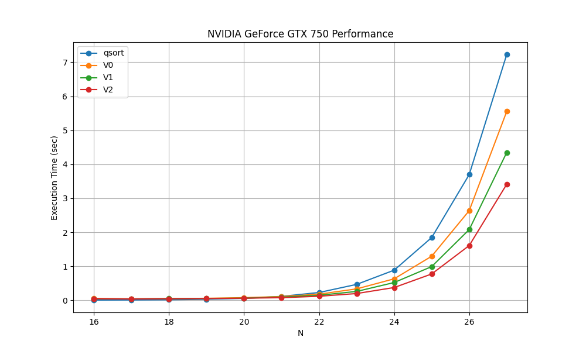

# Bitonic Sort with CUDA

**Authors:** Ioannis Michalainas, Maria Charisi

**Date:** January 2025

## Abstract

This project implements *parallel sorting* using the **Bitonic Sort** algorithm and the **CUDA** framework. The primary objective is to sort a dataset of N = 2<sup>k</sup> numbers (where k is a natural number). The implementation employs parallel processing to achieve efficient sorting, making it suitable for large-scale data sets.

## Installation

### Prerequisites
1. The Microsoft `C` compiler
2. The `CUDA` framework

Barring any incompatibilities, cloning this repository and compiling the source code using the included Makefile should produce the executable.

### Execution

1. Clone this repository
```bash
git clone https://github.com/mariaxarisi/CUDA-sort.git
```
2. Navigate to the correct directory
```bash
cd CUDA-sort
```
3. Compile the program using the included makefile
```bash
make
```

To run the executable across its multiple versions you can run the command `make run {N}`, where 2<sup>N</sup> is the total numbers to be sorted.

To run a specific implementation (for example V0) run:

```bash
./bin/V0 {N}
```

## Testing

### Specifications
This program was executed on a Windows machine with a **NVIDIA GeForce GTX 750 GPU**. We used `CUDA 11.8` to accommodate the low compute capability (5) of the specific graphics card. We tested for values of *N* in the range [16..27], where the total numbers are *N*<sup>2</sup>.

### Results
In the graphic below, we observe the *performance* of the algorithm for different values of *N*, compared to qsort.



## Apendix

For more information about the project, please refer to the `report.pdf` document.